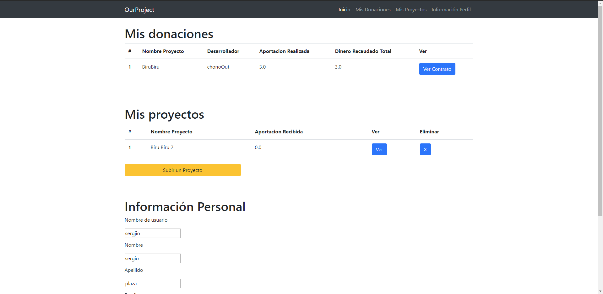
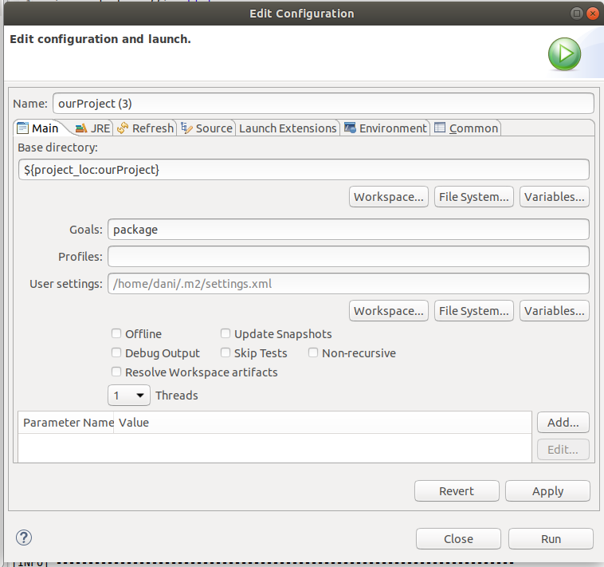

# OurProject

## Descripción
Servicio web basado en mecenazgo por recompensa, en el cual el usuario tendrá la posibilidad tanto de publicar un proyecto propio para conseguir financiación, como apoyar otros proyectos para que lleguen a la meta, y con ello conseguir recompensas.

Este servicio da soporte a proyectos de videojuegos, con la posibilidad de comunicar directamente a contribuidores y desarrolladores, creando así una comunidad mutuamente beneficiosa para el desarrollo de videojuegos.

El desarrollador sólo podrá obtener la financiación recaudada si sobrepasa la meta propuesta. En este caso, el desarrollador será el encargado de hacer llegar las recompensas a los contribuidores. Si no se alcanza la meta en el tiempo asignado, la recaudación será devuelta a cada usuario.

### Funcionalidades públicas
- Visualizar proyectos (información, mensajes de los contribuidores, imágenes, tablas de recompensas...)
- Crear Cuenta

### Funcionalidades privadas
- Publicar/eliminar proyecto
- Contribuir
- Escribir mensajes y valoración (siempre y cuando el proyecto sea propio del usuario o se trate de un contribuidor del proyecto)
- Recibir facturas de los proyectos en los cuales el usuario contribuya
- Recibir notificaciones (correo):
    - Al recibir un nuevo mensaje en un proyecto propio
    - Al recibir una respuesta a un mensaje previamente publicado por el usuario
    - Al alcanzar la meta de presupuesto
    - Al recibir una donación (recibes el contrato con el contribuidor)
___
## Entidades principales
- Proyecto - Conjunto de recursos (información, imágenes, avances, vídeos, recompensas) añadidos por el desarrollador para alcanzar una meta de financiación para su videojuego.
- Contribuyente - Usuario básico, el cual puede acceder a todos los proyectos publicados, así como aportar tanto su opinión y valoración, siempre y cuando haya realizado una contribución al proyecto.
- Desarrollador - Usuario básico con privilegios especiales, como es una interfaz propia para el tratamiento de los proyectos añadidos a *OurProject*
- Comentario - Unidad básica de comunicación entre contribuidores y desarrolladores
- Contrato - Acuerdo entre la contribución realizada por un usuario y las recompensas que podrá obtener.
- Meta - Objetivos parciales de financiación a alcanzar en un proyecto. Su consecución implica desbloquear ciertas partes del proyecto o dar recompensas a todos los usuarios.
- Recompensa - Según la cantidad donada, el desarrollador entregará ciertos beneficios al contribuidor, a mayor cantidad mayores beneficios.

### Diagrama Entidad-Relación

A continuación se detallan las relaciones entre las entidades de forma jerárquica de importancia:

- User:
    * Un Usuario puede contribuir en varios Proyectos, a su vez, varios Proyecto pueden tener multiples contribuidores. Relación **M:N**
    * Un Usuario puede realizar múltiples Comentarios, pero un Comentario solo tiene asociado un Usuario. Relación **1:N**
    * Un Usuario puede aportar dinero a muchos Proyectos por lo que obtiene un Contrato por cada uno, el Contrato relaciona un Usuario y un Proyecto. Relación **1:N**
- Desarrollador:
    * Cuenta con las mismas relaciones que usuario ya que hereda de este, pero incorpora una relación extra con Proyecto. Un Desarrollador desarrolla múltiples Proyectos pero un Proyecto solo tiene un Desarrollador. Relación **1:N**
- Proyecto:
    * Como se explicó anteriormente, cuando un Usuario contribuye a un Proyecto se genera un Contrato. Un proyecto puede tener múltiples Contratos pero un Contrato solo referencia a un Proyecto. Relación **1:N**
    * Lo mismo ocurre con los comentarios que realiza un Usuario sobre un Proyecto. Relación **1:N**
    * Un Proyecto se compone por múltiples Metas a alcanzar en el Proyecto, estas Metas son únicas por Proyecto. Relación **1:N**
    * A su vez un Proyecto también se compone por multiples Recompensas que se otorgarán dependiendo de la cantidad de dinero donada. Su cardinalidad es igual que la relación anterior **1:N**

Las relaciones del resto de clases ya han sido explicadas en los niveles superiores.

### Diagrama UML

## Navegación por el sitio web

A continuación se muestra el esquema general de navegación y transiciones entre las distintas páginas, cada una de ellas se desglosará más adelante.

- Página Principal: contendrá los proyectos disponibles, de todos los desarrolladores, con su nombre y una imagen. Al hacer clic sobre estos proyectos, se despliega un modal que presenta una pequeña descripción del proyecto y permite el acceso a su página con información completa. Además, tendrá accesos directos tanto para cerrar sesión (o iniciar sesión en versiones futuras) como al perfil del propio usuario.

- Página Proyecto: en la página del proyecto se puede ver con todo detalle la información del mismo: el nombre, el desarrollador, la imagen, la descripción, así como dos bloques con las diferentes metas y recompensas. Además, en la parte inferior se encuentra la sección de comentarios.

- Página Donación: se presenta una pantalla simple con la información básica del proyecto al que vas a donar, así como el método de pago si no lo tienes configurado en tu perfil, el número de cuenta y la cantidad de donar.

- Página Perfil: en esta pantalla se presenta toda la información relativa a un usuario, y ésta dependerá de si dicho usuario es desarrollador o no. 
    - Si no eres desarrollador, aparecerán diferentes campos con tu información personal con la posibilidad de editarla, las donaciones que has realizado con sus respectivos contratos y un botón de "convertirse a desarrollador". 
    - Si ya eres un desarrollador, este último desaparece, y en su lugar aparecen los proyectos personales que hayas creado, así como la posibilidad de eliminarlo y acceder a su página.

- Contrato: en la página del perfil, si haces clic en ver contrato, aparecerá un modal en el que podrás ver su información específica, así como las recompensas obtenidas según la cantidad que hayas donado.

- Página Añadir Proyecto: aparecerá un formulario en el que podrás configurar todos los parámetros necesarios para la creación de un proyecto. Estos son: el nombre, una descripción, un tipo de cuenta y número al que se deberá ingresar el dinero de las donaciones. Además, aparecen cinco campos para especificar metas y cinco para recompensas, siendo solo obligatorios el primero de cada tipo.

___
## Funcionalidades Servicio Interno
- Generador de facturas de los contratos firmados entre contribuidor y desarrollador.
- Envio de notificaciones por correo, tanto cuando se firma un contrato, como cuando se realiza una interacción entre desarrollador y contribuidor.
___
# Instrucciones de ejecución
## Instrucciones obtención del .jar
Dentro de Spring nos situamos en la raiz del proyecto our_project. Hacemos click con el boton derecho y nos situamos sobre las *Run as*. En el desplegable pulsamos *Maven build..*.
En el apartado golas escribimos *package*

Tras esto pulsamos sobre *Apply* y posteriormente sobre *Run*
Cuando haya acabado el proceso, en la consola aparecerá la ruta en donde tenemos el jar, normalmente en *./ourProject/target/ourProject-0.0.1-SNAPSHOT.jar*.

Realizamos un proceso análogo con el proyecto Api_Rest. En este caso el jar se encontrará en *./OurProject/API_REST/target/API_REST-0.0.1-SNAPSHOT.jar*

## Instruciones para instalación en Ubuntu 18.04
Necesitaremos dos terminales para ejecutar toda la aplicación:
- ### Instalación máquina virtual de Java
    - Abrimos una terminal y ejecutamos:
        - **sudo apt install default-jre**
    - Si al ejecutar el comando la terminal nos devuelve este error:
        - *E: No se pudo bloquear /var/lib/dpkg/lock-frontend - open (11: Recurso no disponible temporalmente) E: Unable to acquire the dpkg frontend lock (/var/lib/dpkg/lock-frontend), is another process using it?* 
        - Deberemos ejecutar:
            - sudo fuser -vki  /var/lib/dpkg/lock
        - Y posteriormente reintentar la instalación
- ### Instalación MySQL
    - Actualizamos los repositorios para obtener la última versión:
        - **sudo apt update**
    - Ahora ya estamos preparados para instalar MySQL:
        - **sudo apt install mysql-server**
- ### Configuración de MySQL y creación de base de datos
    - Abrimos una terminal MySQL
        - **sudo mysql**
    - A partir de aqui trabajamos dentro de la propia terminal de MySQL
    - Indicamos que el método de autenticación de nuestro usuario root será por contraseña, le indicamos que la contraseña será “password”. Por defecto, esta configurado el inicio de sesión del usuario root mediante auto_socket.
        - **ALTER USER 'root'@'localhost' IDENTIFIED WITH mysql_native_password BY 'password';**
    - Ahora debemos actualizar los privilegios que le hemos otorgado
        - **FLUSH PRIVILEGES;**
    - Ahora creamos la base de datos:
        - **CREATE DATABASE our_project;**
    - Salimos de la terminal de MySQL:
        - **EXIT;**
- ### Ejecución de la aplicación principal
    - Nos dirigimos con la terminal a la ruta en la que tengamos ourProject-0.0.1-SNAPSHOT.jar. *rutadelJar* se sustituirá por la ruta de ourProject-0.0.1-SNAPSHOT.jar.
        - **cd *rutadelJar***
    - Damos a nuestro usuario permisos de ejecución:
        -  **chmod 777 ourProject-0.0.1-SNAPSHOT.jar**
    - Ahora ejecutamos la aplicación principal:
        - **java -jar ourProject-0.0.1-SNAPSHOT.jar**
- ### Ejecución del servicio interno 
    - Ejecutamos una segunda terminal y nos dirigimos a la ruta donde tengamos el archivo API_REST-0.0.1-SNAPSHOT.jar.*rutadelJar* se sustituirá por la ruta de API_REST-0.0.1-SNAPSHOT.jar. 
        - **cd *rutadelJar***
    - Damos a nuestro usuario permisos de ejecución:
        -  **chmod 777 API_REST-0.0.1-SNAPSHOT.jar**
    - Ahora ejecutamos la aplicación principal:
        - **java -jar API_REST-0.0.1-SNAPSHOT.jar**
- ### Acceder a la página web 
    - Ejecutamos un navegador y buscamos:
        - **https://127.0.0.1:8443/ourProject**
        - Si es la primera vez que accedemos es probable que tengamos que aceptar los riesgos de entrar en una página web que no cuenta con certificacion de autenticación de una CA

## Equipo
| Nombres | Correo URJC  | Usuario Git Hub  |
| ------------- |:-------------:| -----:|
| García Rodríguez, Alejandro | a.garciar.2016@alumnos.urjc.es | [DaxelTh](https://github.com/DaxelTH "Usuario Axel") |
| Jiménez Pacheco, Daniel | d.jimenez.2016@alumnos.urjc.es | [Numan4221](https://github.com/Numan4221 "Usuario Daniel") |
| Plaza Larrosa, Sergio | s.plazal.2016@alumnos.urjc.es | [heyimsergio](https://github.com/heyimsergio "Usuario Sergio") |
